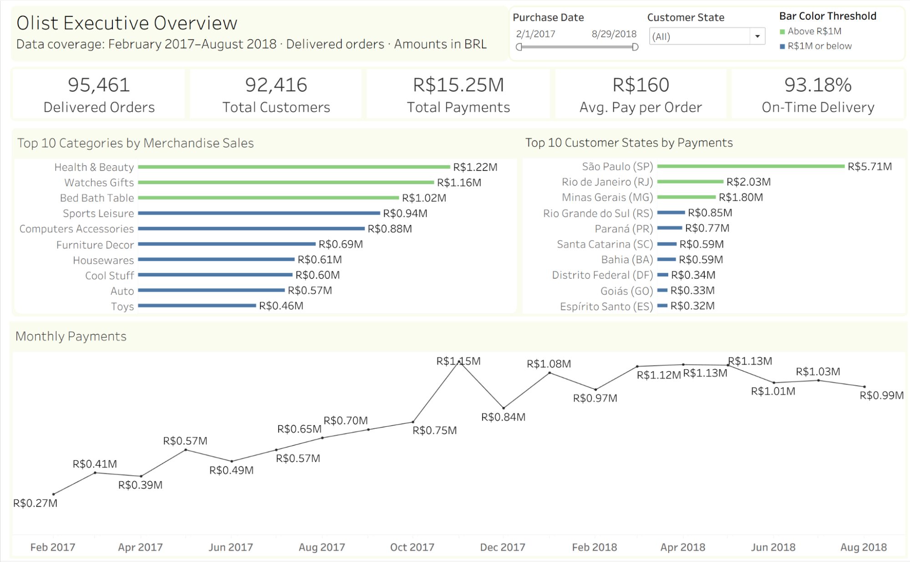

## Olist E-Commerce Analysis | SQL Server & Tableau

An analysis of Brazilian e-commerce orders using SQL Server and Tableau, examining payment trends, delivery performance, and observed repeat purchasing.

## Business questions

- How do payments vary over time, across customer states, and across product categories?
- Where are delivery delays concentrated, and which delivery stage accounts for longer elapsed times?
- How often do customers place another order, including on a later purchase date?

## Executive overview

The main analysis covers delivered orders purchased from February 1, 2017 through August 31, 2018. Amounts are in Brazilian reais (BRL).

| Metric | Result |
| --- | ---: |
| Delivered orders | 95,461 |
| Distinct customers | 92,416 |
| Total payments | R$15,248,329.77 |
| Average payment per order | R$159.73 |
| On-time delivery rate | 93.18% |

The delivery rate uses 95,453 assessable orders: 88,944 on time and 6,509 late. Eight orders are excluded from this denominator because delivery timing could not be assessed.

## Tableau dashboard

The executive dashboard includes five KPI cards, monthly payments, the top ten categories by merchandise sales, and the top ten customer states by payments. Purchase-date and customer-state filters support exploration. Green bars indicate values above R$1 million; blue bars indicate values at or below that threshold.

[View the interactive dashboard on Tableau Public](https://public.tableau.com/views/OlistExecutiveOverview_17891599928450/Dashboard1)

## Findings and business implications

1. **Payments are concentrated geographically.** São Paulo contributes approximately R$5.71 million, followed by Rio de Janeiro at R$2.03 million and Minas Gerais at R$1.80 million. These markets warrant close operational monitoring because of their contribution to payments.
2. **Rio de Janeiro has weaker delivery performance.** Its on-time rate is 87.79%, compared with 93.18% overall. For November 2017 through March 2018, average time after carrier handoff is longer in RJ than in the other states combined, while average time to carrier handoff is similar. Investigate routes and carrier performance in this segment; these comparisons do not establish the cause of delays.
3. **Observed repeat purchasing is uncommon.** 2,741 customers (2.97%) have multiple delivered orders in the analysis window. Only 1,977 (2.14%) purchase on multiple calendar dates. Report these separately so same-day orders are not mistaken for later customer returns.

## Method and metric definitions

- Use `customer_unique_id` to identify a customer across orders; join customers to orders using `customer_id`.
- Aggregate payment entries to one row per order before joining to orders. This avoids multiplying payments when an order has multiple items or payment entries.
- **Total payments** sums order payment values. **Merchandise sales** sums item prices and excludes freight. These measures are intentionally different.
- **On time** means the actual delivery calendar date is on or before the estimated delivery calendar date. Missing dates and invalid chronology are excluded from the assessable denominator.
- Delivery-stage durations count calendar-day boundaries, rather than exact elapsed 24-hour periods.
- The 90-day cohort analysis uses the first observed delivered purchase from available history and the next distinct purchase date. Cohorts run from February 2017 through May 2018, with a data cutoff of August 31, 2018.
- Tableau relates the orders and items exports through `order_id`, preserving their different levels of detail. Date context filters allow Top 10 membership to recalculate for the selected period.

## SQL files

| File | Purpose |
| --- | --- |
| [01_data_quality_and_coverage.sql](sql/01_data_quality_and_coverage.sql) | Coverage, missing values, chronology, and relationship checks |
| [02_business_questions.sql](sql/02_business_questions.sql) | Core business analysis |
| [03_delivery_investigation.sql](sql/03_delivery_investigation.sql) | State and monthly delivery comparisons, including RJ |
| [04_customer_repeat_analysis.sql](sql/04_customer_repeat_analysis.sql) | Repeat customers, contribution, and timing |
| [05_cohort_90_day_repeat.sql](sql/05_cohort_90_day_repeat.sql) | Later-date repeat purchasing within 90 days |
| [06_executive_overview.sql](sql/06_executive_overview.sql) | Dashboard KPI reconciliation |
| [07_export_dashboard_orders.sql](sql/07_export_dashboard_orders.sql) | One row per delivered order for Tableau |
| [08_export_dashboard_items.sql](sql/08_export_dashboard_items.sql) | One row per order item for Tableau |

## Running the analysis

1. Load the dataset into Microsoft SQL Server. The queries expect a database named `Olist` and tables in the `dbo` schema.
2. Review the table and column names in the SQL files against your imported schema before running them. These scripts contain analysis queries, not database creation or CSV ingestion scripts.
3. Open a file in SQL Server Management Studio and run one complete question at a time, including its CTEs and final SELECT.
4. Use file 06 to compare results against the executive metrics above.
5. Export the results of files 07 and 08 with column headers as `olist_dashboard_orders.csv` and `olist_dashboard_items.csv`, then relate them in Tableau using `order_id`.

These SQL scripts were reconstructed from the project analysis conversation and subsequently executed in SQL Server. Dashboard metrics and key analysis results were checked against earlier outputs. The data-quality checks document missing payment records, timestamp anomalies, and unmatched relationships. The scripts used to create the database tables and import the CSV files are not included.

## Dataset reference and limitations

The project uses the Olist Brazilian e-commerce dataset. The [official Olist data-team repository](https://github.com/olist/work-at-olist-data/tree/master/datasets) contains the corresponding dataset filenames. The exact download origin and byte-for-byte provenance of the local copies have not been confirmed. Raw datasets are not included in this repository.

- Results describe delivered orders within the stated window, not all marketplace activity or profit.
- Repeat purchasing is observed within available data, not lifetime retention. Customers may also buy outside this marketplace or observation period.
- Delivery comparisons are descriptive and do not demonstrate causation.
- The latest purchase date among delivered orders in the dashboard export is August 29, 2018; the analysis predicate includes all of August.
- The imported SQL geolocation table contains 1,336 rows (0.1336%) with at least one NULL coordinate. The current local CSV contains no blank, nonnumeric, nonfinite, or globally out-of-range coordinates, so the cause of this discrepancy remains unverified. Geolocation was not used in the reported analyses or dashboard; state analysis uses the customers table.

